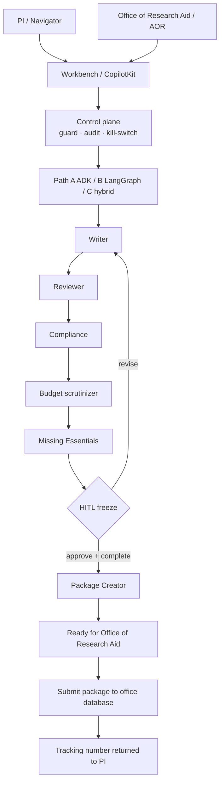

# Grant Agent Lab

**Multi-agent system for drafting, reviewing, compliance-checking, budget-validating, and packaging NIH (and related) grant proposals until they are ready for institutional review and submission.**

Start here: **[configure](docs/guides/how-to-configure.md)** · **[launch UI](docs/guides/how-to-launch-ui.md)** · **[create demos](docs/guides/how-to-create-demo-files.md)** · **[architecture (Mermaid)](docs/architecture.md)** · **[docs index](docs/README.md)**

## Architecture



Full diagrams (system context, paths, RBAC): [docs/architecture.md](docs/architecture.md).

## What this lab does

1. **Drafts** Specific Aims using [grant-proposal-assistant](https://github.com/YPCC/grok-custom-skills/tree/main/skills/grant-proposal-assistant) frameworks.
2. **Reviews** from a mock study-section + [scientific-strategic-review-board](https://github.com/YPCC/grok-custom-skills) lens.
3. **Checks compliance** against NIH SF424-style rules and institutional policies.
4. **Scrutinizes the budget** against NIH modular/detailed norms (does **not** invent a budget).
5. **Scores Missing Essentials** (required R01 package items) and **pauses for HITL**.
6. **Packages** an approved proposal and submits it to the **Office of Research Aid database**. Completing the grouped intake form (compliance, formatting, institutional) unlocks submit. A **tracking number** comes back to the PI. This lab does **not** submit to NIH ASSIST.

Three parallel implementations:

| Path | Stack | Best when |
|------|--------|-----------|
| **Part A** | Pure Google ADK 2.0 + Graph Workflow | Vertex AI Agent Engine, IAM, A2A |
| **Part B** (config default) | Pure LangGraph + MemorySaver / `GrantGraph` | Typed state, revision loops, HITL interrupt |
| **Part C** | **Hybrid**: ADK outer + LangGraph inner | Production ADK + deterministic inner loop |

Switch path in [`config/runtime.yaml`](config/runtime.yaml) (`path: part_a_adk | part_b_langgraph | part_c_hybrid`). Details: [how to configure](docs/guides/how-to-configure.md).

## Quick start — UI

No npm and no model key:

```bash
git clone https://github.com/YPCC/grant-agent-lab.git
cd grant-agent-lab
pip install python-docx
python3 ui-copilotkit/serve_workbench.py
```

Open [http://127.0.0.1:8765](http://127.0.0.1:8765). Review the sample R01 Aims `.docx`, inspect the checklist, try HITL revise/approve, switch role to Office of Research Aid to see Submit enable (demo only).

**Recorded demos** (watch first):

| UI | Video |
|----|--------|
| CopilotKit Next.js (`:3000`) | [e2e-copilotkit-demo.mp4](docs/demo/e2e-copilotkit-demo.mp4) (46s, intake → office tracking) |
| Python workbench (`:8765`) | [e2e-workbench-demo.mp4](docs/demo/e2e-workbench-demo.mp4) (30s, intake → office tracking) |

CopilotKit Next.js (optional chat):

```bash
cd ui-copilotkit && npm install --legacy-peer-deps && npm run dev
```

See [how to launch the UI](docs/guides/how-to-launch-ui.md).

## Record a demo

Demos are Playwright walkthroughs encoded to H.264 MP4 (1440×900) in [`docs/demo/`](docs/demo/). Full recipe: [how to create demo files](docs/guides/how-to-create-demo-files.md).

```bash
pip install playwright python-docx
python3 -m playwright install chromium   # ffmpeg also required

# Terminal A — UI
PYTHONPATH=. python3 ui-copilotkit/serve_workbench.py

# Terminal B — record
PYTHONPATH=. python3 scripts/record_demo.py --target workbench
# or, with Next.js already on :3000:
PYTHONPATH=. python3 scripts/record_demo.py --target copilotkit
```

That overwrites `docs/demo/e2e-*-demo.mp4` plus matching `still-*.png`. Do not commit `node_modules/`, `.next/`, or raw WebM.

## Quick start — agents / tests

```bash
python -m venv .venv && source .venv/bin/activate
pip install -e ".[dev]"
PYTHONPATH=. python -m pytest tests/ -q
```

Optional LLM keys (gitignored `.env`): `GOOGLE_API_KEY`, `OPENAI_API_KEY`, `XAI_API_KEY`.

## Repository layout

```
grant-agent-lab/
├── README.md
├── docs/
│   ├── README.md                 # docs index
│   ├── architecture.md           # Mermaid diagrams
│   ├── demo/                     # recorded E2E UI walkthrough
│   ├── guides/
│   │   ├── how-to-configure.md
│   │   ├── how-to-launch-ui.md
│   │   └── how-to-create-demo-files.md
│   └── architecture-considerations/  # EA notes + draw.io
├── scripts/
│   └── record_demo.py            # Playwright + ffmpeg recorder
├── config/
│   ├── runtime.yaml              # path, HITL, agents
│   ├── checklists/r01_essentials.yaml
│   └── policies/
├── src/
│   ├── shared/checklist.py
│   ├── control_plane/
│   ├── part_a_adk/
│   ├── part_b_langgraph/
│   └── part_c_hybrid/
├── ui-copilotkit/                # workbench + CopilotKit
├── data/samples/
└── tests/
```

## Diagram color legend

Used in [draw.io](docs/architecture-considerations/) files:

| Color | Meaning |
|-------|---------|
| Blue (`#dae8fc` / `#6c8ebf`) | ADK / UI / deployment |
| Green (`#d5e8d4` / `#82b366`) | LangGraph nodes |
| Yellow (`#fff2cc` / `#d6b656`) | Knowledge / FOA freshness |
| Rose (`#f8cecc` / `#b85450`) | Human-in-the-loop |
| Purple (`#e1d5e7` / `#9673a6`) | Shared state |

## Documentation

| Guide | Description |
|-------|-------------|
| [Docs index](docs/README.md) | All guides |
| [How to configure](docs/guides/how-to-configure.md) | `runtime.yaml`, agents, HITL, env |
| [How to launch UI](docs/guides/how-to-launch-ui.md) | Workbench and CopilotKit |
| [How to create demo files](docs/guides/how-to-create-demo-files.md) | Record MP4 + stills |
| [Demo videos](docs/demo/README.md) | CopilotKit UI + Python workbench walkthroughs |
| [Architecture (Mermaid)](docs/architecture.md) | System context, graph, RBAC |
| [Architecture considerations](docs/architecture-considerations/README.md) | EA packet, Cloud SQL, Cloud Run |
| [Part B LangGraph + HITL](docs/part-b-langgraph-hitl.md) | Interrupt-before-freeze |
| [Budget & package](docs/budget-and-package-agent.md) | Scrutinizer + package creator |
| [Control plane](docs/control-plane-integration.md) | AGT / agent-control-lab |
| [Datasets](docs/datasets-and-validation.md) | NIH samples & RePORTER |
| [CopilotKit UI](ui-copilotkit/README.md) | DOCX review showcase |

## How to cite this package

### BibTeX

```bibtex
@software{grant_agent_lab_2026,
  title        = {Grant Agent Lab: Multi-Agent System for NIH Grant Proposal Drafting, Review, Compliance, Budget Validation, and Packaging},
  author       = {{Grant Agent Lab Contributors}},
  year         = {2026},
  url          = {https://github.com/YPCC/grant-agent-lab},
  note         = {Hybrid Google ADK 2.0 + LangGraph implementation under an AGT-style control plane}
}
```

### Inline

> …using Grant Agent Lab (https://github.com/YPCC/grant-agent-lab), a multi-agent system for NIH proposal drafting through institutional packaging.

When discussing the control-plane pattern, also cite [Agent Control Lab](https://github.com/YPCC/agent-control-lab) and Microsoft’s Agent Governance Toolkit (AGT).

## References

1. **grant-proposal-assistant skill** — https://github.com/YPCC/grok-custom-skills/tree/main/skills/grant-proposal-assistant
2. **scientific-strategic-review-board skill** — https://github.com/YPCC/grok-custom-skills
3. **Agent Control Lab** — https://github.com/YPCC/agent-control-lab
4. **Microsoft AGT** — https://opensource.microsoft.com/blog/2026/04/02/introducing-the-agent-governance-toolkit-open-source-runtime-security-for-ai-agents/
5. **NIH RePORTER API v2** — https://api.reporter.nih.gov/
6. **NIH SF424 / Modular Budget** — https://grants.nih.gov/grants-process/write-application/advice-on-application-sections/develop-your-budget
7. **NIAID / NIDCD sample applications** — https://www.niaid.nih.gov/grants-contracts/sample-applications
8. **LangGraph** — https://github.com/langchain-ai/langgraph
9. **Google ADK 2.0** — https://google.github.io/adk-docs/

## License

Apache-2.0 (or align with institutional / upstream preferences).
