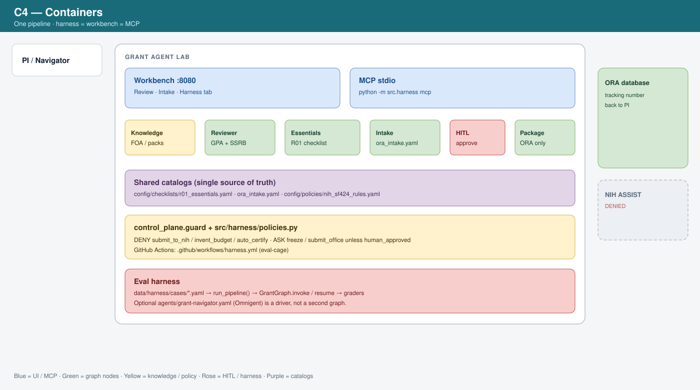
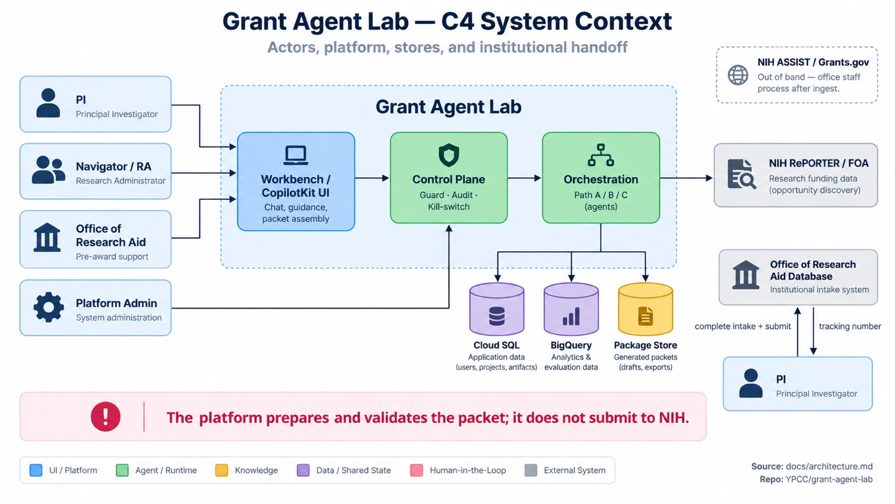
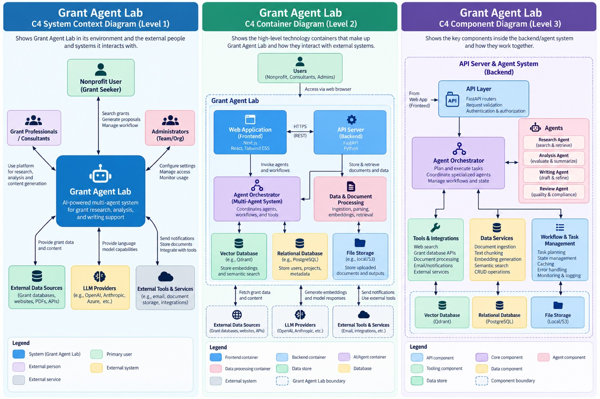
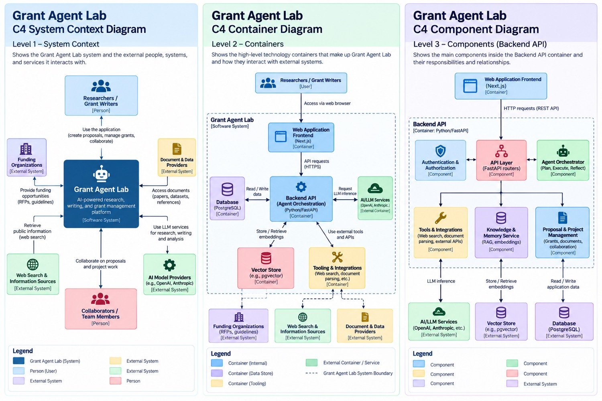

# C4 infographics

Presentation-ready C4 views of Grant Agent Lab. Editable draw.io sources remain next to this folder. Mermaid lives in [architecture.md](../../architecture.md).

**Canonical for this lab (current code):** the unified SVG pair (one `GrantGraph`, control-plane ALLOW/DENY/ASK, MCP, eval harness, optional Langfuse). The office-handoff JPG is still the submit-contract poster. The two triptychs are Level 1–3 C4 posters in a more generic grant-platform vocabulary.

| Infographic container | This lab |
|-----------------------|----------|
| Web Application | Workbench `serve_workbench.py` **:8080** (Review + Intake + Harness tabs) + CopilotKit |
| MCP / Copilot | `python3 -m src.harness mcp` · `plugin/vscode/mcp.json` |
| API / Agent orchestrator | **Part B GrantGraph** (CI / workbench / harness default) · Path A ADK · Path C hybrid |
| Agents | Knowledge, Reviewer (GPA+SSRB), Missing Essentials, Intake, Package creator |
| Control plane | `src/control_plane/guard.py` + `src/harness/policies.py` |
| Observability | Optional Langfuse — span per `guard()` call ([observability.md](../../observability.md)) |
| Eval cage | `data/harness/cases/` · GitHub Actions `harness.yml` |
| Relational DB | Cloud SQL (PostgreSQL) |
| File storage | Package store (`output/packages/`, GCS in prod) |
| External data | NIH RePORTER / FOA only (read) |
| Official sponsor submit | **Out of band / DENY** — NIH ASSIST is office staff after ingest |

NIH ASSIST / Grants.gov is **not** a lab actor. Submit is to the **Office of Research Aid database**; a tracking number returns to the PI.

## Files

| File | C4 level | Use |
|------|----------|-----|
| [c4-system-context-unified.svg](c4-system-context-unified.svg) | Context (this lab, current) | Actors, workbench+MCP, GrantGraph, guard, Langfuse, ORA DB, ASSIST denied |
| [c4-containers-one-pipeline.svg](c4-containers-one-pipeline.svg) | Containers (this lab, current) | Nodes, catalogs, harness, CI, Langfuse |
| [c4-system-context-office-handoff.jpg](c4-system-context-office-handoff.jpg) | Context (submit contract) | Office handoff poster |
| [c4-levels-1-2-3-grant-seeker.jpg](c4-levels-1-2-3-grant-seeker.jpg) | L1 + L2 + L3 poster | Generic grant-seeker / consultant / admin triptych |
| [c4-levels-1-2-3-researchers.jpg](c4-levels-1-2-3-researchers.jpg) | L1 + L2 + L3 poster | Researchers / grant-writers triptych |

### 1. System context — unified (canonical)

The platform prepares and validates the packet; **it does not submit to NIH**. Harness cases call the same graph.

### 2. Containers — one pipeline

### 3. System context — office handoff (JPG)

### 4. C4 Levels 1–3 — grant-seeker poster

### 5. C4 Levels 1–3 — researchers poster

Color meaning matches the lab legend: blue = UI / MCP, green = agent runtime, yellow = knowledge / policy, purple = catalogs, rose = HITL / harness, dashed gray = external / optional (NIH ASSIST denied · Langfuse).
