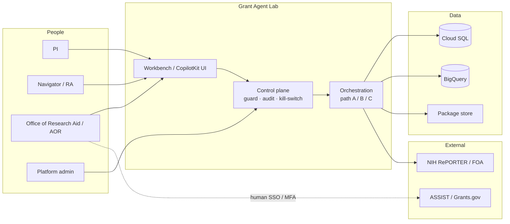
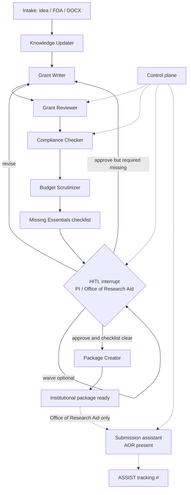
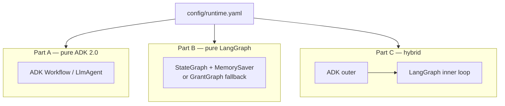
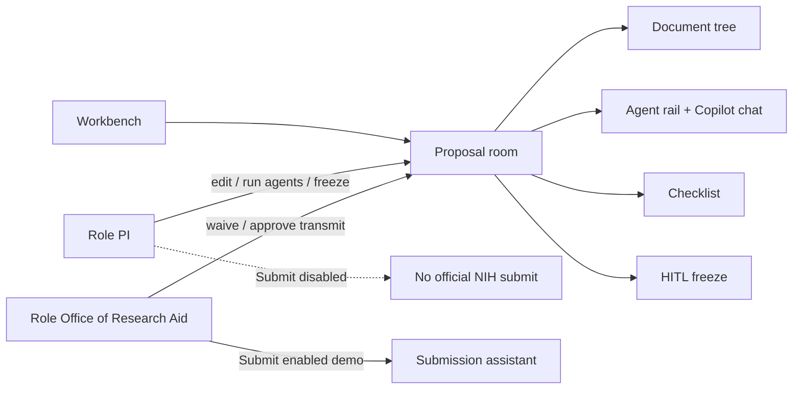
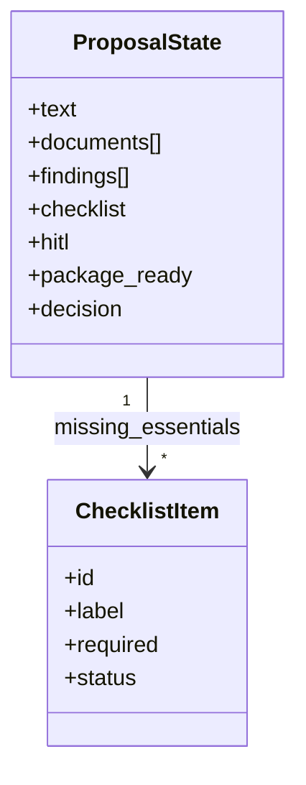

# Architecture (Mermaid)

GitHub renders these diagrams on the repo. Editable draw.io files live in [architecture-considerations](architecture-considerations/README.md).

## System context

Who talks to the lab. Official NIH submit stays with Office of Research Aid / AOR.

## Agent graph (Part B default)

Deterministic scientific loop with HITL **before** freeze. Missing Essentials is a first-class node.

## Runtime paths

Same agents; different outer runtime. Switch with `path:` in [`config/runtime.yaml`](../config/runtime.yaml).

## UI and RBAC

## Shared state (conceptual)

Color legend used in draw.io (same meaning as README): blue = ADK / UI, green = LangGraph nodes, yellow = knowledge, rose = HITL, purple = shared state.
