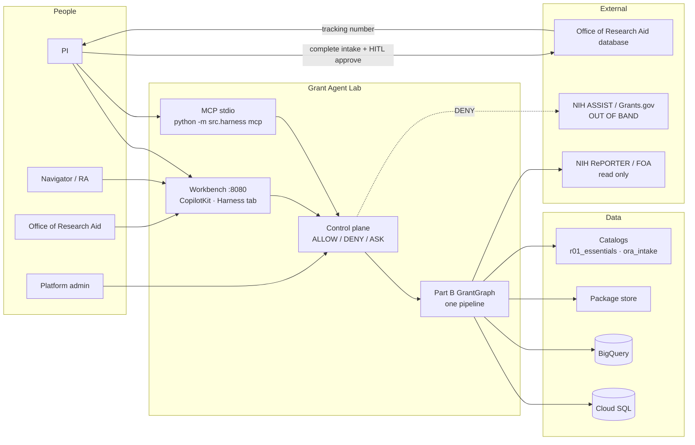
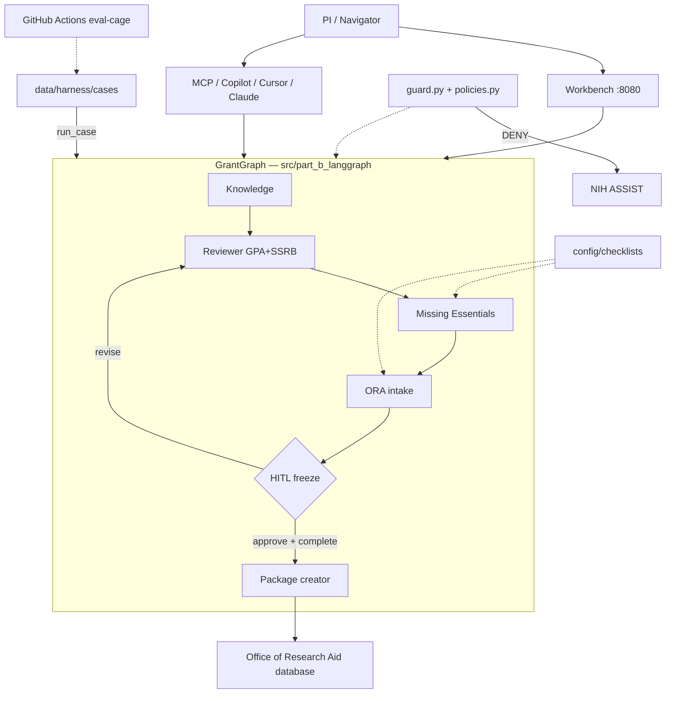
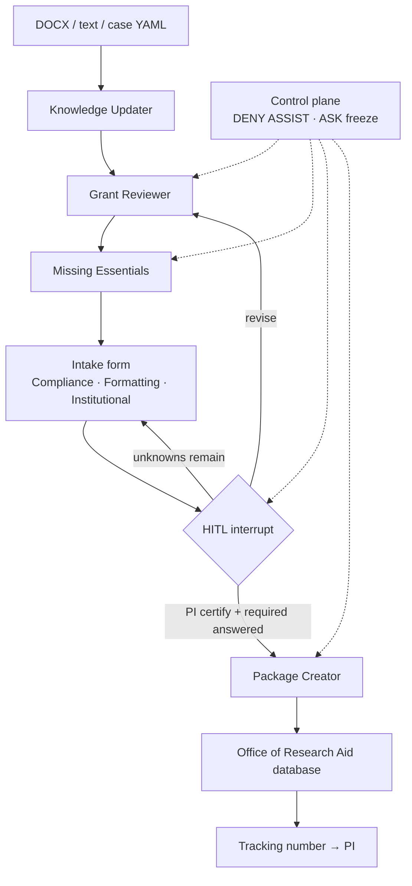
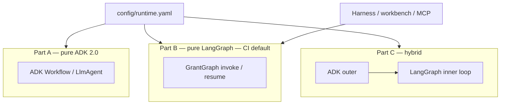
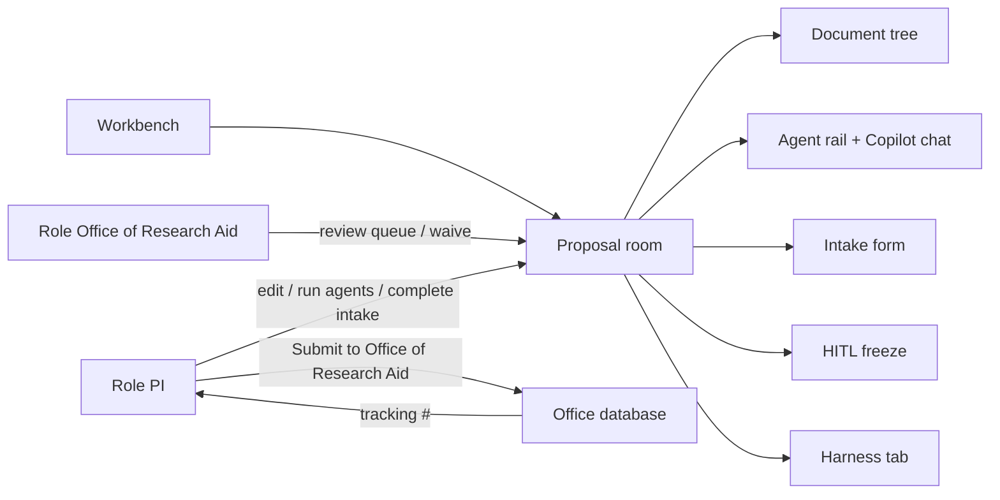
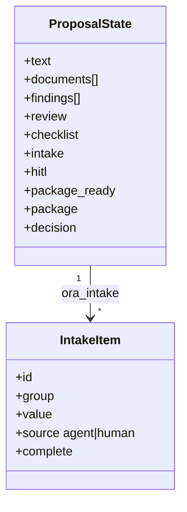

# Architecture (Mermaid)

GitHub renders these diagrams on the repo.

- **C4 infographics (posters + SVG):** [architecture-considerations/c4-infographics](architecture-considerations/c4-infographics/README.md)
- **Editable draw.io:** [architecture-considerations](architecture-considerations/README.md)

This lab’s submit path ends at the **Office of Research Aid database**. NIH ASSIST / Grants.gov is **out of band** (office staff, not the agents). **Harness cases, the workbench, and MCP all invoke the same Part B `GrantGraph`.**

## C4 infographics

Canonical system context for this lab (updated SVG — one pipeline + guard + MCP):

Office-handoff JPG (still valid for the submit contract):

Level 1–3 posters (generic grant-platform vocabulary, mapped in the infographics README):

- [C4 L1–L3 — grant-seeker](architecture-considerations/c4-infographics/c4-levels-1-2-3-grant-seeker.jpg)
- [C4 L1–L3 — researchers](architecture-considerations/c4-infographics/c4-levels-1-2-3-researchers.jpg)

## C4 — system context (Mermaid)

Actors, the lab, stores, and the **office database** (NIH ASSIST is not a lab actor).

## C4 — containers (one pipeline)

## Agent graph (Part B default — source of truth)

Writer / compliance / budget scrutinizer remain available on paths A and C. Path B default is the cage the CI gates.

## Runtime paths

Same catalogs and control plane; different outer runtime. Switch with `path:` in [`config/runtime.yaml`](../config/runtime.yaml). **Eval harness currently drives Part B `GrantGraph`.**

## UI and RBAC

PI **can** submit the packet to the office. Nobody in this lab submits to NIH.

## Shared state (conceptual)

Intake catalog: [`config/checklists/ora_intake.yaml`](../config/checklists/ora_intake.yaml). Narrative: [intake and office submit](intake-and-office-submit.md). Harness: [harness.md](harness.md). Guard: [control-plane-integration.md](control-plane-integration.md).

Color legend used in draw.io and SVG (same meaning as README): blue = UI / MCP, green = LangGraph nodes, yellow = knowledge / policy, rose = HITL, purple = shared catalogs.
