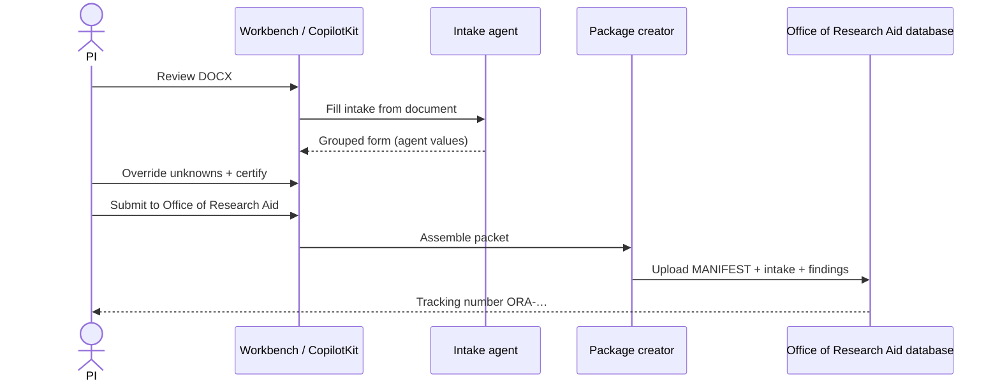

# Office of Research Aid intake and office submit

This lab **does not submit to NIH** (ASSIST / Grants.gov / eRA). The PI completes a grouped **intake form**, the packaging agent uploads a packet to the **Office of Research Aid database**, and a **tracking number** (`ORA-YYYYMMDD-xxxxxx`) is written back onto the PI record.

## Form groups

Catalog: [`config/checklists/ora_intake.yaml`](../config/checklists/ora_intake.yaml).

| Group | Examples |
|-------|----------|
| **Compliance** | Budget element present, human subjects, vertebrate animals, select agents, DMS plan, COI |
| **Formatting** | Specific Aims ≤ 1 page, Research Strategy page limit, NIH font/margins, file naming |
| **Institutional** | PI eligibility, F&A acknowledgment, cost sharing, subawards, export control, **PI certify** |

The **Intake agent** fills each row from the DOCX (`source: agent`). The PI or Navigator may override (`source: human`). **PI certify** is human-only and cannot be auto-checked.

Submit to the office is enabled only when every **required** item has a value other than `unknown`.

## Sequence

## Package contents

Written under `output/packages/<tracking>/` by [`src/shared/packaging.py`](../src/shared/packaging.py):

- `MANIFEST.json` — destination = office database, not NIH_ASSIST
- `intake-form.json` — completed form with agent vs human sources
- `findings.json`
- `proposal-excerpt.txt`
- `TRACKING.txt`

## APIs

| Endpoint | Role |
|----------|------|
| `POST /api/review` | Review + auto-fill intake |
| `POST /api/intake` | Apply human overrides |
| `POST /api/submit-office` | Package + tracking |
| `GET /office/packages/<id>` | Office-side record (demo) |

CopilotKit action: `submitToOfficeOfResearchAid`.

## What stays out of this lab

- eRA passwords, MFA replay, ASSIST file mapping
- Autonomous NIH submit
- Budget *planning* (the scrutinizer only validates presence/norms)
